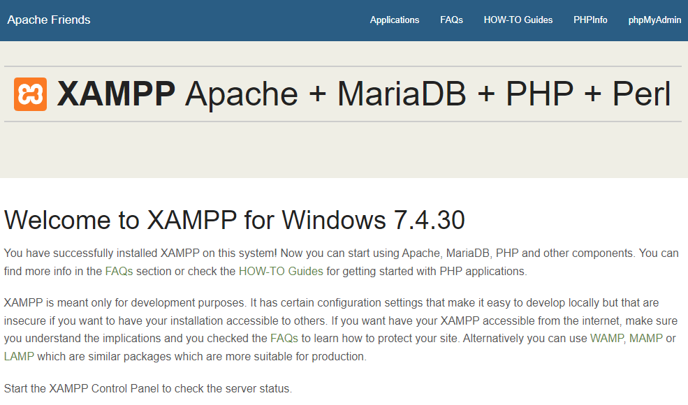

# Créer un serveur sur votre macine
## Installation
### Download
Vous devez d'abord télécharger la configuration de XAMPP, vous pouvez la trouver ici : (page de téléchargement)[https://www.apachefriends.org/download.html]. Choisissez votre système d'exploitation, puis téléchargez-le. Exécutez la configuration et suivez les étapes. Choisissez un répertoire pour l'installer et attendez un peu.

### Lancement
Ouvrez le panneau de configuration XAMPP. Vous pouvez voir une liste des services installés sur votre appareil par la configuration. Dans ce tutoriel, nous utiliserons les deux premiers, Apache (pour le serveur web) et MySQL (pour les bases de données). Cliquez sur le bouton de démarrage et attendez que le nom soit coloré en vert clair. Ensuite, allez sur un navigateur web (comme Google Chrome ou Mozilla Firefox) et tapez dans la barre d'adresse [localhost](http://localhost). Si l'installation a réussi, vous pouvez avoir un tableau de bord XAMPP. Ressemble à ça:

N.B. Si vous tapez [https://localhost](https://localhost), le navigateur bloquera votre connexion et affichera un message d'erreur rouge. C'est parce que le HTTPS est basé sur des certificats SSL et qu'ils doivent être signés par une société extérieure. Le certificat localhost est signé automatiquement et le navigateur Web ne leur fait pas confiance. Si vous souhaitez toujours accéder à votre page en HTTPS suivez la procédure suivante :

* Sur Google Chrome (et navigateur basé sur chromium) : cliquez sur le bouton `Avancé` (en bas à gauche) puis cliquez sur le lien `Proceed to localhost (unsafe)`.
* Sur Mozilla Firefox : cliquez sur le bouton "Avancé" (en bas à droite) puis cliquez sur le bouton "Accepter le risque et continuer" (en bas à droite).

Sinon, vous pouvez taper `http://` avant (la communication ne sera pas cryptée mais cela n'a pas d'importance car la communication avec votre hôte local se fait uniquement en local et ne dépend pas du réseau).

Maintenant, votre hébergeur local est prêt à l'emploi !

[< Previous](./1.Start.md)

[Next >](./3.Configuration.md)